  <a href="https://github.com/sinankp31">
    <picture>
      <source media="(prefers-color-scheme: dark)" srcset="dark_mode.svg">
      <source media="(prefers-color-scheme: light)" srcset="light_mode.svg">
      
    </picture>
  </a>

  
  

---

## 🛠️ Tech Stack

  
  
  
  
  
  
  
  
  
  
  
  
  
  

---

## 🚀 Featured Projects

| Project | Description | Tech |
|---------|-------------|------|
| [**Veto**](https://github.com/sinankp31/veto) | VETO is a full-stack clothing store with refresh-token rotation, a per-size stock cart, ImageKit image uploads, and a seller dashboard for managing products. | `React` `Node.js` `MongoDB` `Express` `Vite` |
| [**Posty**](https://github.com/sinankp31/posty) | Posty is a full-stack photo gallery where users upload images with captions and browse them in a searchable, responsive gallery | `Javascript` `Express.js` `MongoDB` `ImageKit` `React` `Node.js` |
| [**Shrinky**](https://github.com/sinankp31/shrinky) | A full-stack URL shortener that turns long links into short ones, redirects with a 302 and counts clicks | `Javascript` `MongoDB` `REST APIs` `React` `Node.js` |

---

## 📫 Let's Connect

  
  
  
  

  

